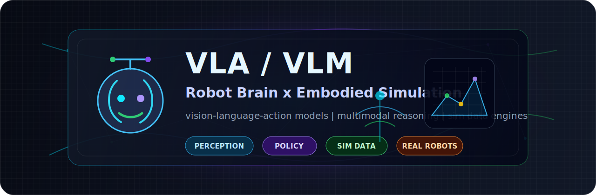

<p align="center">
  
</p>

<h1 align="center">Longtao Wu</h1>

<p align="center">
  Building robot intelligence across VLA, VLM, simulation data, and embodied AI systems.
</p>

<p align="center">
  <a href="https://longtao.fun">Website</a> ·
  <a href="https://huggingface.co/eustance">Hugging Face</a> ·
  <a href="https://x.com/eustancewu">X</a>
</p>

<p align="center">
  <a href="https://github.com/eust-w?tab=repositories">
    
  </a>
  <a href="https://github.com/eust-w?tab=stars">
    
  </a>
  <a href="https://github.com/eust-w">
    
  </a>
</p>

---

### Focus

I work on the stack that makes robots understand, plan, and act in the real world: multimodal perception, embodied policy, robot brain architecture, simulation data engines, and runtime infrastructure.

<p align="center">
  
</p>

```txt
Perception          VLMs, multimodal grounding, scene understanding
Policy             VLA models, robot action heads, task-level planning
Embodiment         robot "big brain / small brain" architecture
Simulation Data    synthetic data, real2sim, sim2real validation loops
Infrastructure     data engines, evaluation, deployment, robot runtime tooling
```

### What I Am Building Toward


### Engineering Interests

- Vision-language-action models for robot skills and generalist policies
- VLM-based scene parsing, affordance reasoning, and instruction grounding
- Robot brain architecture: high-level cognition plus low-level control/runtime
- Large-scale simulation data generation, curation, replay, and evaluation
- Real2sim asset pipelines, digital twins, domain randomization, and sim2real tests
- Tooling that turns research prototypes into inspectable, repeatable systems

### Selected Work Surface

My public repositories also include AI agent infrastructure, developer tools, model routing, code review automation, and knowledge workflows. Those systems are useful building blocks for robotics work because embodied AI needs the same discipline: traceable data, reproducible evaluation, observable runtime behavior, and reliable deployment.

| Layer | Direction |
| --- | --- |
| Robot big brain | multimodal planning, world understanding, instruction grounding |
| Robot small brain | motion/runtime orchestration, control adapters, execution feedback |
| VLA / VLM | policy learning, scene semantics, action grounding, evaluation |
| Simulation data | synthetic scenes, real2sim assets, domain randomization, dataset QA |
| AI infrastructure | agents, code automation, model routing, workflow verification |

<p align="center">
  
</p>

### Current Direction

I am especially interested in systems where:

- simulation produces data that is good enough to train or evaluate robot policies
- VLMs provide semantic world models instead of just image captions
- VLA policies connect language goals to executable robot actions
- runtime infrastructure makes robot behavior observable, debuggable, and reproducible

### Tech Surface

<p>
  
  
  
  
  
  
  
  
</p>

### GitHub Signal

<p align="center">
  
  
</p>

<p align="center">
  
</p>

---

<p align="center">
  <b>VLA / VLM / Robotics / Simulation Data / Embodied AI</b>
</p>
