<div align="center">
  
  <br />
  <br />
  <a href="https://longtao.fun">
    
  </a>
  <h1>Longtao Wu</h1>
  <p><strong>VLA / VLM robotics builder working on robot brain architecture, simulation data, Real2Sim pipelines, and embodied AI runtime systems.</strong></p>
  <p><strong>机器人大小脑 · 多模态感知 · 仿真数据 · Real2Sim · 可观测运行时</strong></p>
  <p>
    <a href="https://longtao.fun">Website</a> ·
    <a href="https://huggingface.co/eustance">Hugging Face</a> ·
    <a href="https://x.com/eustancewu">X</a> ·
    <a href="README_CN.md">中文</a> ·
    <a href="README_FR.md">Français</a> ·
    <a href="README_RU.md">Русский</a> ·
    <a href="README_AR.md">عربي</a> ·
    <a href="README_JP.md">日本語</a> ·
    <a href="README_PTBR.md">Português</a> ·
    <a href="README_TR.md">Türkçe</a>
  </p>
  <p>
    
    
    
  </p>
</div>

```txt
robot-runtime.console
$ boot --stack vla-vlm --mode embodied
> perception=vlm  policy=vla  sim=real2sim
> brain=planner+controller  data=observable
> status=online  latency=adaptive  loop=closed
```

### Focus

I build the stack behind robot intelligence: multimodal perception, VLA policy learning, robot big brain / small brain architecture, simulation data engines, Real2Sim assets, and runtime infrastructure that makes behavior inspectable.

<p align="center">
  
</p>

### Moving System Map

```mermaid
flowchart LR
  A[World Data] --> B[Simulation Engine]
  B --> C[Embodied Dataset]
  C --> D[VLM World Model]
  D --> E[VLA Policy]
  E --> F[Robot Big Brain]
  F --> G[Small Brain Runtime]
  G --> H[Real Robot Feedback]
  H --> A

  style A fill:#020617,stroke:#22d3ee,color:#ffffff
  style B fill:#020617,stroke:#8b5cf6,color:#ffffff
  style C fill:#020617,stroke:#22c55e,color:#ffffff
  style D fill:#020617,stroke:#f59e0b,color:#ffffff
  style E fill:#020617,stroke:#fb7185,color:#ffffff
  style F fill:#020617,stroke:#38bdf8,color:#ffffff
  style G fill:#020617,stroke:#a3e635,color:#ffffff
  style H fill:#020617,stroke:#facc15,color:#ffffff
```



### What Is Running In My Head

| Layer | Direction |
| --- | --- |
| Robot big brain | multimodal planning, instruction grounding, memory, tool use |
| Robot small brain | motion/runtime orchestration, controller adapters, execution feedback |
| VLA / VLM | scene semantics, action grounding, policy learning, evaluation |
| Simulation data | synthetic scenes, Real2Sim assets, domain randomization, dataset QA |
| AI infrastructure | agents, code automation, model routing, workflow verification |

<p align="center">
  
</p>

### Selected Work Surface

My public repositories include robotics-adjacent AI infrastructure, developer tools, model routing, code review automation, knowledge workflows, and simulation/product systems. I care about systems that can be observed, debugged, reproduced, and improved instead of only looking impressive in a demo.

| Area | Project | What it does |
| --- | --- | --- |
| AI agents | [kakashi](https://github.com/eust-w/kakashi) | Codex-powered system for searching GitHub capabilities, planning repository fusion, executing changes, and verifying the result. |
| AI tooling | [ai_code_reviewer](https://github.com/eust-w/ai_code_reviewer) | LLM-based code review automation for GitHub, GitLab, and Gitea, with multi-model support. |
| Model routing | [openai-chat-switch](https://github.com/eust-w/openai-chat-switch) | Go package for chat embeddings and model/chat switching workflows. |
| Learning systems | [little_language_model](https://github.com/eust-w/little_language_model) | Small language-model experiments and implementation notes. |
| Developer tools | [esh](https://github.com/eust-w/esh) | Cross-platform SSH connection manager with encrypted credentials and cluster command execution. |
| Infrastructure | [qcow2file](https://github.com/eust-w/qcow2file) | Builds qcow2 VM images from Dockerfile-like recipes. |
| Knowledge workflow | [obsidian-image-auto-upload](https://github.com/eust-w/obsidian-image-auto-upload) | Obsidian plugin for automatically uploading pasted or dropped images to external storage. |

### Tech Surface

<p>
  
  
  
  
  
  
  
  
</p>

### GitHub Signal

<p align="center">
  
  
</p>

<p align="center">
  
</p>

<p align="center">
  
</p>

---

<p align="center">
  <a href="https://longtao.fun">
    
  </a>
  <br />
  <b>VLA / VLM / Robotics / Simulation Data / Embodied AI</b>
</p>
