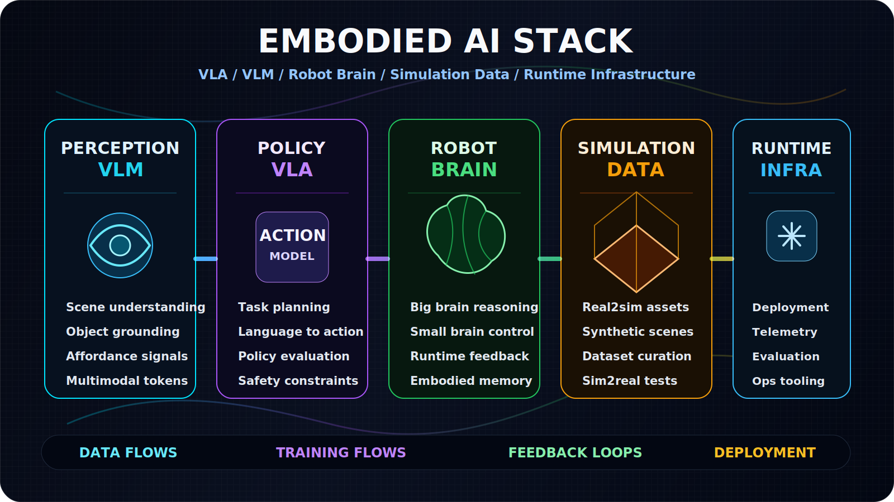
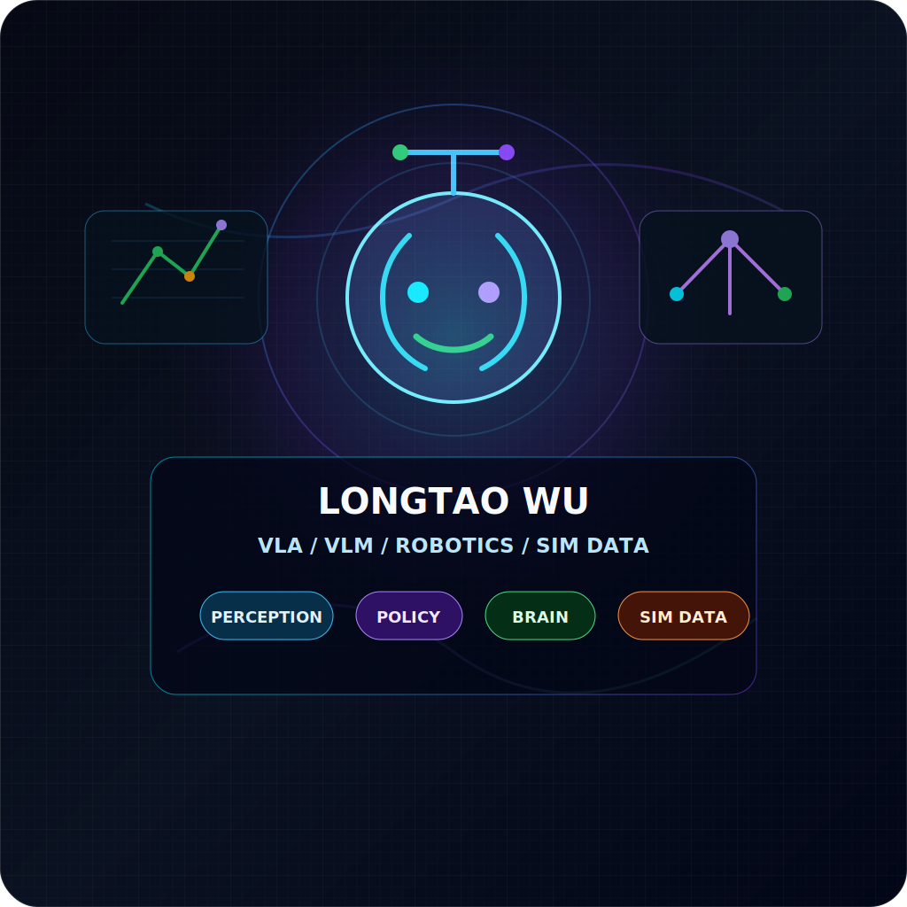
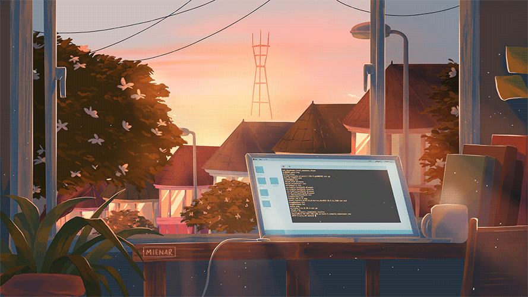

<div align="center">
  
  <br />
  <br />
  <a href="https://longtao.fun">
    
  </a>
  <h1>Longtao Wu</h1>
  <p><strong>我做 VLA / VLM 机器人系统，关注机器人大小脑、仿真数据、Real2Sim 管线和具身智能运行时。</strong></p>
  <p><strong>Robot brain architecture · Multimodal perception · Simulation data · Real2Sim · Observable runtime</strong></p>
  <p>
    <a href="README.md">English</a> ·
    <a href="https://longtao.fun">个人网站</a> ·
    <a href="https://huggingface.co/eustance">Hugging Face</a> ·
    <a href="https://x.com/eustancewu">X</a> ·
    <a href="README_FR.md">Français</a> ·
    <a href="README_RU.md">Русский</a> ·
    <a href="README_AR.md">عربي</a> ·
    <a href="README_JP.md">日本語</a> ·
    <a href="README_PTBR.md">Português</a> ·
    <a href="README_TR.md">Türkçe</a>
  </p>
  <p>
    
    
    
  </p>
</div>

```txt
robot-runtime.console
$ boot --stack vla-vlm --mode embodied
> perception=vlm  policy=vla  sim=real2sim
> brain=planner+controller  data=observable
> status=online  latency=adaptive  loop=closed
```

### 当前关注

我构建机器人智能背后的系统栈：多模态感知、VLA 策略学习、机器人“大脑 / 小脑”架构、仿真数据引擎、Real2Sim 资产，以及能让行为可观察、可调试、可复现的运行时基础设施。

English summary: I build the stack behind robot intelligence, from multimodal perception and policy learning to simulation data, Real2Sim assets, and real robot runtime loops.

<p align="center">
  
</p>

### 动态系统图


### 我的机器人系统分层

| 层级 | 方向 |
| --- | --- |
| 机器人大脑 | 多模态规划、指令 grounding、记忆、工具调用 |
| 机器人小脑 | 运动 / 运行时编排、控制器适配、执行反馈 |
| VLA / VLM | 场景语义、动作 grounding、策略学习、评估 |
| 仿真数据 | 合成场景、Real2Sim 资产、域随机化、数据集 QA |
| AI 基础设施 | agents、代码自动化、模型路由、工作流验证 |

<p align="center">
  
</p>

### 代表工作面

我的公开仓库包含机器人相关的 AI 基础设施、开发者工具、模型路由、代码审查自动化、知识工作流以及仿真 / 产品系统。我更关心能被观察、调试、复现和持续改进的系统，而不是只在 demo 里好看。

| 方向 | 项目 | 说明 |
| --- | --- | --- |
| AI agents | [kakashi](https://github.com/eust-w/kakashi) | 基于 Codex 的 GitHub 多仓库能力搜索、融合规划、代码执行和真实验证系统。 |
| AI tooling | [ai_code_reviewer](https://github.com/eust-w/ai_code_reviewer) | 面向 GitHub、GitLab、Gitea 的 LLM 代码审查自动化，支持多模型接入。 |
| 模型路由 | [openai-chat-switch](https://github.com/eust-w/openai-chat-switch) | 面向 chat embeddings 和模型 / 会话切换工作流的 Go 包。 |
| Learning systems | [little_language_model](https://github.com/eust-w/little_language_model) | 小型语言模型实验与实现记录。 |
| Developer tools | [esh](https://github.com/eust-w/esh) | 跨平台 SSH 连接管理工具，支持凭据加密和集群命令执行。 |
| Infrastructure | [qcow2file](https://github.com/eust-w/qcow2file) | 根据 Dockerfile 风格描述生成 qcow2 虚拟机镜像。 |
| Knowledge workflow | [obsidian-image-auto-upload](https://github.com/eust-w/obsidian-image-auto-upload) | 自动上传 Obsidian 粘贴或拖拽图片，并替换为在线链接。 |

### 技术栈

<p>
  
  
  
  
  
  
  
  
</p>

### GitHub 信号

<p align="center">
  
  
</p>

<p align="center">
  
</p>

<p align="center">
  
</p>

---

<p align="center">
  <a href="https://longtao.fun">
    
  </a>
  <br />
  <b>VLA / VLM / Robotics / Simulation Data / Embodied AI</b>
</p>
